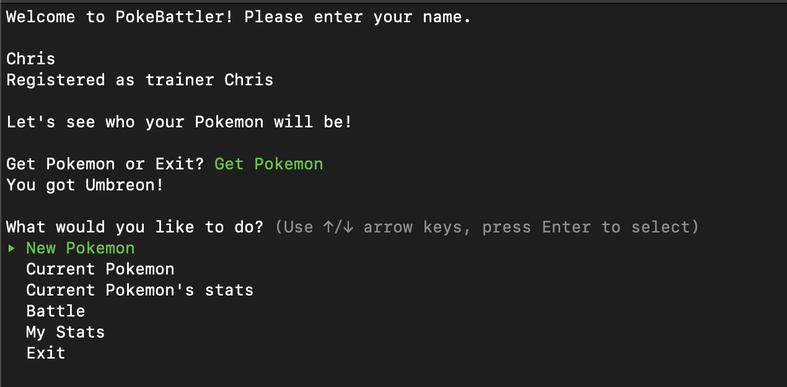
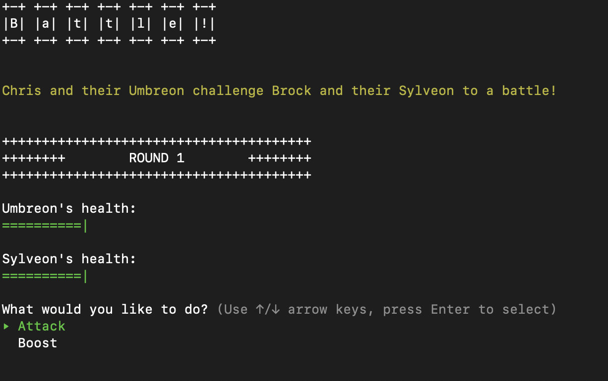

# PokéBattler

### Features
* Pick between 9 different Pokémon to use!
* Participate in quick, 1 v 1 battles!
* Track your statistics over time!

### Install
* Fork and Clone this repo
* run ```bundle install```
* run ```ruby bin/run.rb``` from your command line to start the application

### Usage
* Enter your name to be added to the system or to return to your previous account (case sensitive!)
* Pick a new Pokémon after login 
* From the Main Menu, you can choose a new Pokémon, battle, check your stats, or check your current Pokémon's stats
  * Pokémon only have HP, Attack, and Speed in this simulation
* In battle, choose between Attack or Boost
  * Boost with randomly increase your current Pokémon's attack or speed

### Screenshots




#### Credits
* All Pokémon names are owned trademarks of Nintendo / GAME FREAK.
* ASCII Character Artist: Maija Haavisto (MH), @DiamonDie on Twitter.


#### License

Copyright (C) 2020 Christopher Wagstaffe

Permission is hereby granted, free of charge, to any person obtaining a copy
of this software and associated documentation files (the "Software"), to deal
in the Software without restriction, including without limitation the rights
to use, copy, modify, merge, publish, distribute, sublicense, and/or sell
copies of the Software, and to permit persons to whom the Software is
furnished to do so, subject to the following conditions:

The above copyright notice and this permission notice shall be included in all
copies or substantial portions of the Software.

THE SOFTWARE IS PROVIDED "AS IS", WITHOUT WARRANTY OF ANY KIND, EXPRESS OR
IMPLIED, INCLUDING BUT NOT LIMITED TO THE WARRANTIES OF MERCHANTABILITY,
FITNESS FOR A PARTICULAR PURPOSE AND NONINFRINGEMENT. IN NO EVENT SHALL THE
AUTHORS OR COPYRIGHT HOLDERS BE LIABLE FOR ANY CLAIM, DAMAGES OR OTHER
LIABILITY, WHETHER IN AN ACTION OF CONTRACT, TORT OR OTHERWISE, ARISING FROM,
OUT OF OR IN CONNECTION WITH THE SOFTWARE OR THE USE OR OTHER DEALINGS IN THE
SOFTWARE.
